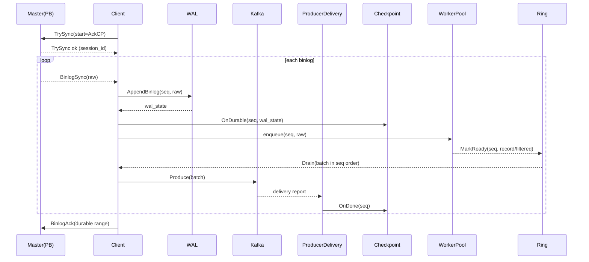
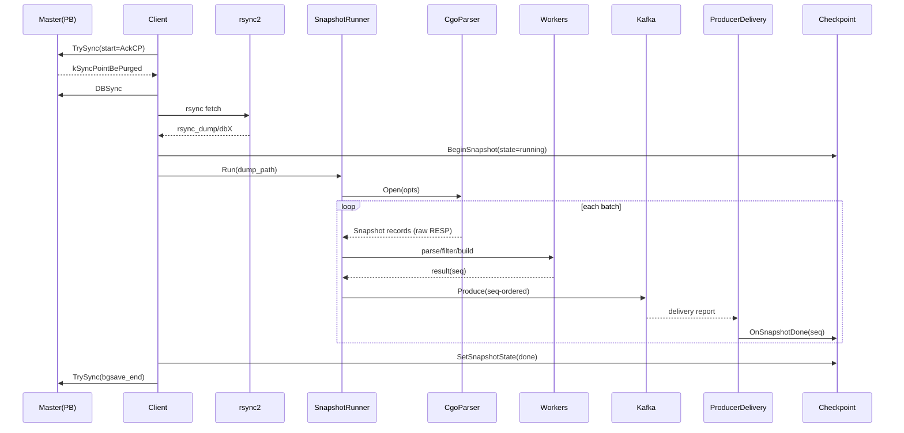
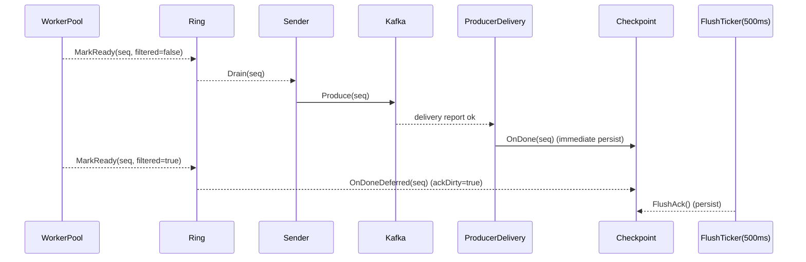

# PikiwiDB → Kafka（Go/PB 实现）架构与实现说明

> 本文档以当前代码实现为准（不做未来设想）。
> 适用版本：Go 实现（PB only），当前工作区代码状态。

---

## 1. 目标与范围

- **PB only**：Go 版本仅支持 PB 协议；`sync_protocol` 在配置中会被忽略。
- **全量 + 增量**：支持 DBSync/rsync 快照 + binlog 增量。
- **Kafka 输出**：支持 `dual`（snapshot/binlog 分 topic）或 `single`（合并 topic）。

---

## 2. 关键术语

- **seq**：本进程内部递增序号。
  - binlog：每条收到的 binlog 对应一个 seq。
  - snapshot：每条快照记录对应一个 seq（跨 reader 全局递增）。
- **epoch**：PB 会话代数（使用 TrySync 返回的 session_id）。
- **DurableCP**：WAL 已落盘的连续前缀（用于 master ACK）。
- **AckCP**：Kafka delivery success 的连续前缀（用于对外一致性/恢复）。
- **SnapshotSeq**：快照处理完成的连续前缀（Kafka 送达或过滤完成）。

---

## 3. 不变量（基于当前实现）

- **seq 单调递增**：binlog 和 snapshot 各自的 seq 递增且不回退。
- **AckCP 连续推进**：仅在 Kafka delivery success 或过滤完成后推进，且必须连续。
- **DurableCP 单调推进**：每次 WAL 追加成功后推进。
- **binlog 发送顺序**：ring 只允许 head 连续 ready 才能发送，确保 seq 顺序。
- **snapshot 顺序发送**：通过 `pending` map 按 seq drain，按 seq 顺序 Produce。

---

## 4. 模块划分（代码对应）

- **main**：加载配置、构建 Filter、Checkpoint、Kafka Producer、WAL、Snapshot Runner、Repl Client。
- **repl.Client**：PB 握手、TrySync/DBSync、binlogLoop。
- **snapshot.Runner**：快照读取/解析/过滤/发送。
- **wal.Writer**：binlog 原始字节持久化（分段 WAL）。
- **checkpoint.Manager**：`checkpoint.json` 管理（AckCP/DurableCP/Snapshot）。
- **kafka.Producer**：Kafka 生产者 + delivery 回调推进 checkpoint。
- **filter.Filter**：过滤规则（binlog & snapshot 共用）。
- **event.Builder**：事件 JSON 构建（binlog / snapshot）。

---

## 5. 起点选择与启动逻辑

- **起点来源优先级**：
  1) 配置文件/命令行显式指定 `filenum/offset`。
  2) `start_from_master=true` 时从 master 当前位点开始。
  3) 否则使用 `checkpoint.json` 中的 `ack_cp`。
- **DBSync 触发条件**：TrySync 返回 `kSyncPointBePurged` 才进入 DBSync。

---

## 6. 增量同步（binlog）实现细节

### 6.1 主流程（顺序处理）

1. `TrySync` 使用 `AckCP` 位点。
2. 收到 binlog：分配 `seq`。
3. WAL 追加写入（`wal.Writer.AppendBinlog`）。
4. 更新 DurableCP（`checkpoint.OnDurable`）。
5. 投递到 worker pool（解析 RESP → 过滤 → 构建事件）。
6. worker 结果进入 ring：
   - **需要发送**：记录入 ring。
   - **被过滤**：`OnDoneDeferred`（AckCP 延迟落盘）。
7. ring 以 seq 为槽位，按 head 连续 ready 才能 drain。
8. Sender 串行 Produce，Kafka delivery success 调用 `OnDone` 推进 AckCP。
9. ACK 给 master 的范围由 DurableCP 决定（与 Kafka ACK 解耦）。

### 6.2 并发模型

- **单 receiver**：`binlogLoop` 中顺序接收 PB binlog。
- **WAL 单写**：每条 binlog 立即写 WAL。
- **Worker Pool 并行**：解析 + 过滤 + 构建事件。
- **Ring Window 顺序发送**：ring 以 **seq 为槽位**。
- **单 Sender**：串行 Produce。
- **ACK/Flush 协程**：
  - `ackKeepaliveLoop`：定时发送空 ACK。
  - `FlushAck`：500ms 周期持久化 `OnDoneDeferred` 的 AckCP。

---

## 7. 全量同步（snapshot）实现细节

### 7.1 触发与切换

1. TrySync 返回 `kSyncPointBePurged`。
2. DBSync/rsync 拉取快照至 `rsync_dump/dbX`。
3. 读取 `rsync_dump/dbX/info`，得到 `bgsave_end_file_num/offset`。
4. `checkpoint.BeginSnapshot(state=running)`。
5. `snapshot.Runner` 解析快照并发送 Kafka。
6. 快照完成后 `checkpoint.SetSnapshotState(state=done)`。
7. 将 AckCP 起点设置为 `bgsave_end`。
8. 重新 TrySync，进入 binlogLoop。

> 当前实现为**先完成快照，再进入增量**；不会与 binlog 并行接收。

### 7.2 Cgo 解析器（Pikiwi storage）

- 直接打开 `rsync_dump/dbX` 的 RocksDB 数据。
- 支持扫描类型：`string/list/hash/set/zset`。
- `stream` 在 type_mask 中可选，但当前扫描阶段未实现。

**快照转 RESP 命令规则**：

- string → `SET key value [EX ttl]`
- list → `RPUSH key v1 v2 ...`（按 `batch_num` 分批）
- hash → `HMSET key f1 v1 f2 v2 ...`（按 `batch_num` 分批）
- set → `SADD key v1 v2 ...`（按 `batch_num` 分批）
- zset → `ZADD key s1 m1 s2 m2 ...`（按 `batch_num` 分批）
- TTL > 0 → 额外输出 `EXPIRE key ttl`

**额外规则**：
- 跳过 `_internal:slotkey:4migrate:` 前缀的 key。
- `snapshot_list_tail_n > 0` 时，仅输出 list 最后 N 条。

### 7.3 Reader 规划（从 Filter 推导）

- `snapshot_reader_mode=single|type`：
  - `single`：一个 reader，合并 type mask。
  - `type`：按类型拆多个 reader。
- `snapshot_reader_types=auto|...`：
  - `auto`：根据 filter 推导 type mask；无法推导则全类型。
- `snapshot_reader_prefixes=auto|...`：
  - `auto`：若 filter 可解析出前缀，则生成 pattern；否则 `*`。

### 7.4 Snapshot Pipeline（实际并发）

- **多 Reader 并发**：每个 spec 启一个 reader。
- **窗口令牌**：`window_slots` 作为 in-flight 上限。
- **Worker 并发**：RESP 解析 + 过滤 + 构建 JSON。
- **顺序 drain**：使用 `pending` map 按 seq 顺序发送/确认。
- **Sender**：在主 goroutine 顺序 Produce（无单独 sender 线程）。

---

## 8. Checkpoint 管理（当前实现）

`checkpoint.json` 字段（见 `internal/checkpoint/checkpoint.go`）：

- `ack_cp`：Kafka delivery success 连续前缀。
- `durable_cp`：WAL 已落盘连续前缀（含 `wal_segment/wal_offset`）。
- `snapshot`：快照状态（state/bgsave_end/ snapshot_seq）。

**推进规则**：

- **DurableCP**：每条 WAL 追加成功后立即更新并落盘。
- **AckCP**：
  - Kafka delivery success → `OnDone` 立即落盘；
  - 被过滤的 binlog → `OnDoneDeferred`，500ms 周期 `FlushAck` 才落盘。
- **SnapshotSeq**：
  - 快照记录 Kafka delivery success → `OnSnapshotDone`；
  - 快照记录被过滤 → Runner 直接 `OnSnapshotDone`。

**示例（节选）**：

```json
{
  "version": 1,
  "source_id": "<master_ip:port>",
  "epoch": 11,
  "ack_cp": {"seq": 82226, "filenum": 267, "offset": 76760742},
  "durable_cp": {"seq": 82447, "filenum": 267, "offset": 76836081, "wal_segment": 1, "wal_offset": 33084480},
  "snapshot": {"state": "done", "bgsave_end_file_num": 267, "bgsave_end_offset": 45044585, "snapshot_seq": 57102467}
}
```

---

## 9. WAL 设计（实际实现）

- 文件名：`wal-<start_filenum>-<start_offset>-<segment>.log`（例如 `wal-00000267-00000000000045044585-00000001.log`）。
- 分段大小：`wal_segment_bytes`（默认 256MB）。
- 记录结构（小端，固定头 56 bytes）：

```
struct WalRecordHeader {
  uint32 magic;        // 'PWAL'
  uint16 header_len;   // 56
  uint8  version;      // 1
  uint8  record_type;  // 1=BINLOG_RAW, 2=SNAPSHOT(保留)
  uint16 flags;        // 预留
  uint16 reserved;
  uint32 epoch;
  uint64 seq;
  uint32 filenum;
  uint64 offset;
  uint32 payload_len;
  uint32 payload_crc32c;
  uint32 header_crc32c;
  uint32 reserved2;
  uint32 reserved3;
}
```

- 当前只写 **BINLOG_RAW**（payload = PB binlog 原始 bytes）。

### 9.1 WAL 清理（当前实现）

- **文件命名**：`wal-<start_filenum>-<start_offset>-<segment>.log`（固定宽度，便于排序）。
- **清理触发**：每次 rotate 后启动一个协程进行清理检查。
- **删除规则**：
  - 以 **AckCP(filenum, offset)** 为安全点；
  - 仅删除 **完整落在 AckCP 之前** 的旧 segment；
  - 保留最近 `wal_retain_segments` 个 segment。

---

## 10. Kafka 发送与分区

- Producer（librdkafka）配置：
  - `acks=all`
  - `enable.idempotence` 可配置
  - `max.in.flight.requests.per.connection=1`
  - `message.max.bytes` 可配置
- 分区键：`db:data_type:key`。
- `kafka_stream_mode`：
  - `dual`：snapshot → `kafka_topic_snapshot`，binlog → `kafka_topic_binlog`。
  - `single`：全部 → `kafka_topic_single`。

---

## 11. 事件格式（实际输出）

### 11.1 Snapshot

- `event_type="snapshot"`
- `op`、`data_type`、`db`、`slot=0`、`key`
- `args`（按 `args_encoding` 编码）
- `raw_resp`（`include_raw_resp=true` 时输出）
- `ts_ms`：当前时间
- `event_id="snapshot:db:data_type:key"`
- `source_id` 与 `source`（host/port）

### 11.2 Binlog

- `event_type="binlog"`
- `ts_ms`：来自 binlog ExecTime
- `event_id="term:filenum:offset:logic_id"`
- `binlog` 对象：`filenum/offset/logic_id/server_id/term_id`
- `raw_resp`：对 `pksetexat` 会转换为 `setex`（保持 C++ 行为）

---

## 12. 时序图（按现实现画）

### 12.1 Binlog 增量流程



### 12.2 Snapshot 全量流程



### 12.3 ACK/落盘节流时序图



---

## 13. 监控与日志

- **snapshot progress**：每 5s 输出 read/enqueued/parsed/produced/filtered 等。
- **binlog progress**：`binlog_progress_interval` 控制输出间隔。
- **ack delay warn**：`pb_ack_delay_warn`。
- **idle timeout**：`pb_idle_timeout`。

---

## 14. 已知限制（基于当前代码）

- WAL 预读/非均匀调度未实现。
- snapshot 与 binlog 不并行接收（先全量再增量）。
- Snapshot reader 支持 type_mask 的 streams 但未实现扫描阶段。

---

本文档反映当前实现，不包含未落地设计。
